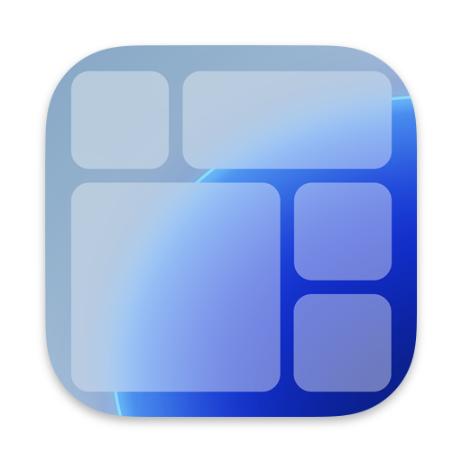
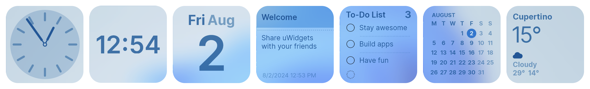

  
  

      
    <h3>uWidgets</h3>
    Widgets for you  
      <b><a href="https://github.com/creewick/uWidgets/releases">Download</a></b> ・
      <a href="https://github.com/users/creewick/projects/4">Roadmap</a> ・
      <a href="https://github.com/creewick/uWidgets/wiki/API">API</a> ・
      <a href="https://github.com/creewick/uWidgets/issues">Report a bug</a> ・
      <a href="https://github.com/creewick/uWidgets/discussions">Discussions</a>
        
  

## Features

### Widgets

5 types of fully customizable widgets

| Widget  | Description                                          |
|---------|------------------------------------------------------|
| 🕒 Clock | 3 styles of Analog clock, World clock, Digital clock |
| 📅 Calendar | Today view and Month view                            |
| 🗒️ Notes | Interactive widget to store text notes               |
| ✅ Reminders | Interactive widget with a to-do list                 |
| ⛅️ Weather | Weather forecast for your location                   |

### Themes

- Light / Dark theme support
- Transparency effects (Acrylic background)
- Monochrome theme

## System requirements

- Windows 8.1 or later 
- [.NET 8.0 Runtime](https://dotnet.microsoft.com/en-us/download/dotnet/8.0)

## Installation

1. Download the [latest release](https://github.com/creewick/uWidgets/releases)
2. Extract the archive
3. Launch `uWidgets.exe`

## Collaboration

uWidgets is built with modularity in mind. 
That means you can create your own widgets using C#.

Check the [API Reference](https://github.com/creewick/uWidgets/wiki/API)

## License

<a property="dct:title" rel="cc:attributionURL" href="https://github.com/creewick/uWidgets">uWidgets</a> by <a rel="cc:attributionURL dct:creator" property="cc:attributionName" href="https://github.com/creewick">creewick</a> is licensed under <a href="https://creativecommons.org/licenses/by-nc-sa/4.0/?ref=chooser-v1" target="_blank" rel="license noopener noreferrer" style="display:inline-block;">CC BY-NC-SA 4.0 </a>

